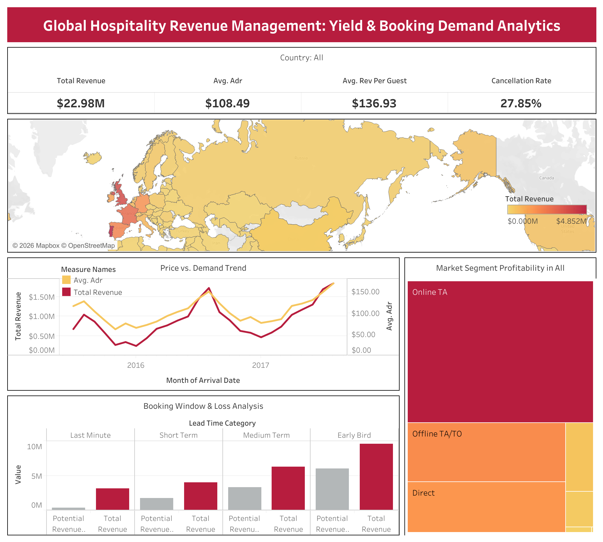

# Global Hospitality Revenue Management: Strategic Yield & Booking Demand Analytics

## 📌 Project Overview
This project focuses on optimizing hotel revenue performance by analyzing guest booking patterns, pricing strategies (ADR), and cancellation risks. Using a comprehensive hotel reservation dataset, I performed end-to-end data processing—from **Data Cleaning** and **Feature Engineering** in Python to creating an **Executive-Level Dashboard** in Tableau.

The goal is to provide actionable insights for stakeholders to mitigate revenue loss and capitalize on high-demand periods.

## 🛠️ Tech Stack
* **Data Processing:** Python (Pandas, NumPy)
* **Analysis:** Jupyter Notebook
* **Visualization:** Tableau Desktop

## 🔍 Key Business Insights
* **Revenue Performance:** Total actual revenue reached **$22.98M** with an average **Cancellation Rate of 27.85%**.
* **Price vs. Demand:** Identified a positive correlation between seasonality and Average Daily Rate (ADR), pinpointing optimal pricing windows.
* **Loss Mitigation:** The **Early Bird** segment shows the highest potential revenue loss, suggesting a need for stricter non-refundable deposit policies.
* **Market Segmentation:** **Online Travel Agents (TA)** drive the highest volume, while **Direct** bookings yield a higher Revenue per Guest.

## 📊 Dashboard Preview

> **Interactive Version:** [View the Live Tableau Dashboard Here](https://public.tableau.com/views/GlobalHospitalityRevenueManagement/GlobalHospitalityRevenueManagementDashboard?:language=en-US&:sid=&:redirect=auth&:display_count=n&:origin=viz_share_link)

